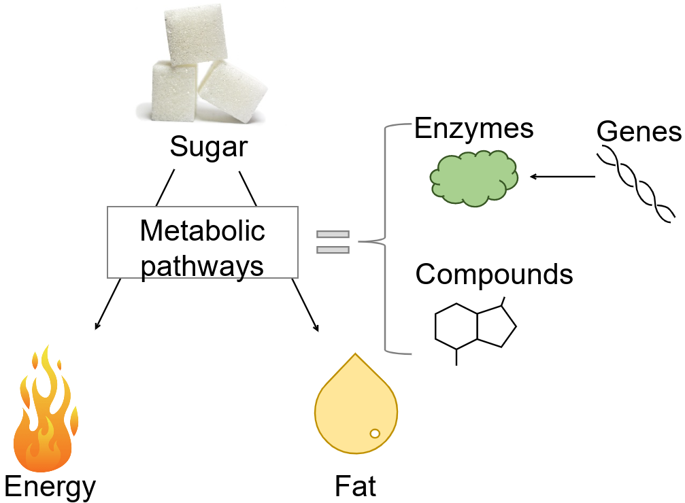
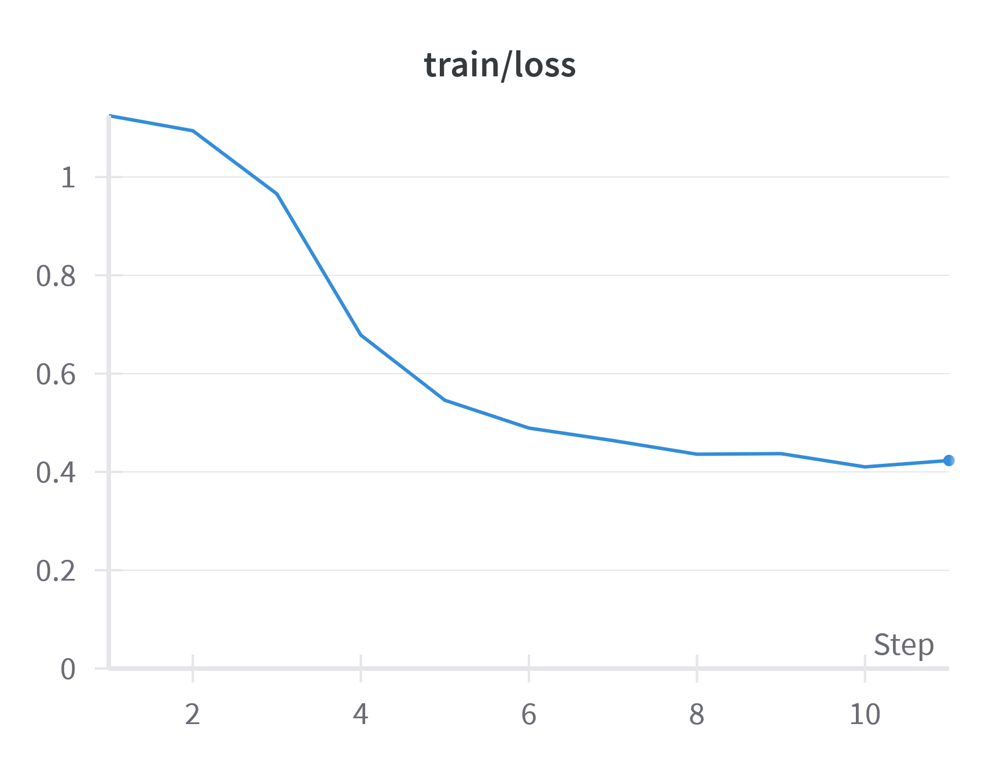
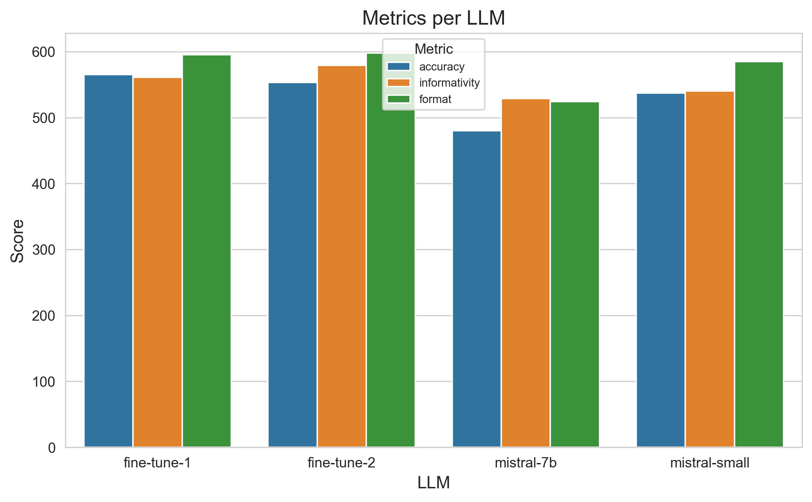
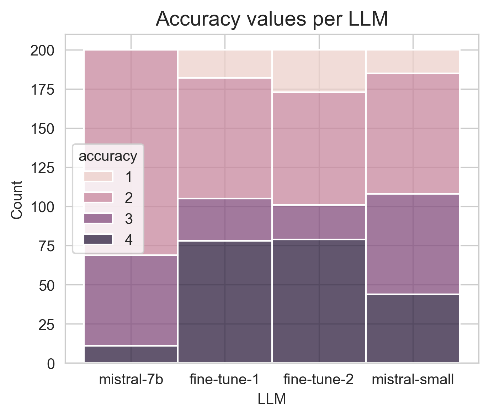

# metabo-assistant

This project was developed for the [Mistral AI Fine-tuning Hackathon](https://mistral.ai/news/2024-ft-hackathon/),
taking place in June 2024.

___

* [Video presentation](#video-presentation)
* [Scientific background](#scientific-background)
  * [Train dataset verifications](#train-dataset-verifications)
  * [Fine-tuning](#fine-tuning)
* [Design](#design)
  * [LLM role - application behavior](#llm-role---application-behavior)
  * [Metabolic data collection](#metabolic-data-collection)
  * [Train dataset](#train-dataset)
* [Evaluation of the models](#evaluation-of-the-models)
* [Usage](#usage)
  * [Streamlit Cloud](#streamlit-cloud)
  * [Locally](#locally)
* [Areas for development](#areas-for-development)
  * [Fine-tuning](#fine-tuning-1)
  * [Evaluation of the models](#evaluation-of-the-models-1)

## Video presentation

https://github.com/csdevignes/metabo-assistant/assets/159613482/b297ea39-5ae3-4bf6-84b9-9a69074b4f99

> [Download video](https://github.com/csdevignes/metabo-assistant/raw/main/assets/presentation.mp4)

## Scientific background

Inside the cells, metabolic **pathways** are what determine how nutrients are used, for example if sugar is going to be
converted to energy or fat.
They are composed of enzymes produced from **genes**. These enzymes convert **compounds** (for example sugar) into another
(for example fat).



Metabolic pathways are often altered in many diseases. To study these pathways in an exploratory way, researchers rely
on the measurements of gene expression and compound amounts. Often, they start from a list of genes, and a list of
compounds, and want to deduce from these which metabolic pathway is involved.

### Impact

An AI model trained to accurately identify altered metabolic pathway from experimental results could allow researcher
to gain significant amount of time. It could also raise interesting candidates, that researchers may not have thought
of initially. Cell metabolism is very complex and composed of intricated and cross-reacting pathways. Taking advantage
of **large language models (LLM)** synthesis ability can allow to quickly extract research leads from exploratory datasets.

## Design

### LLM role - application behavior

The idea is to fine-tune a simple LLM model with data from cell metabolism, and assess if it can, based on a given list
of genes and compound, make interesting and relevant suggestions of altered metabolic pathways.

### Metabolic data collection

I extracted **real examples** from a couple scientific publications where researcher deduced a metabolic pathway from list of altered
genes and compounds. These are listed in [LittData.xlsx](prompts/LittData.xlsx). References:

```
Altea-Manzano, P., Doglioni, G., Liu, Y., Cuadros, A.M., Nolan, E., Fernández-García, J., Wu, Q., Planque, M., Laue, K.J., Cidre-Aranaz, F., Liu, X.-Z., Marin-Bejar, O., Van Elsen, J., Vermeire, I., Broekaert, D., Demeyer, S., Spotbeen, X., Idkowiak, J., Montagne, A., Demicco, M., Alkan, H.F., Rabas, N., Riera-Domingo, C., Richard, F., Geukens, T., De Schepper, M., Leduc, S., Hatse, S., Lambrechts, Y., Kay, E.J., Lilla, S., Alekseenko, A., Geldhof, V., Boeckx, B., de la Calle Arregui, C., Floris, G., Swinnen, J.V., Marine, J.-C., Lambrechts, D., Pelechano, V., Mazzone, M., Zanivan, S., Cools, J., Wildiers, H., Baud, V., Grünewald, T.G.P., Ben-David, U., Desmedt, C., Malanchi, I., Fendt, S.-M., 2023. A palmitate-rich metastatic niche enables metastasis growth via p65 acetylation resulting in pro-metastatic NF-κB signaling. Nat Cancer 4, 344–364. https://doi.org/10.1038/s43018-023-00513-2
Whitburn, J., Rao, S.R., Morris, E.V., Tabata, S., Hirayama, A., Soga, T., Edwards, J.R., Kaya, Z., Palmer, C., Hamdy, F.C., Edwards, C.M., n.d. Metabolic profiling of prostate cancer in skeletal microenvironments identifies G6PD as a key mediator of growth and survival. Sci Adv 8, eabf9096. https://doi.org/10.1126/sciadv.abf9096
```

I also extracted from [KEGG](https://www.kegg.jp) and NCBI databases the list of all metabolic pathways,
and for each the list of genes and compounds involved (see [kegg-dataextract](https://github.com/csdevignes/kegg-dataextract) repository). This database was used
to generate **database examples**.

While working with the database I realized that some pathways had zero compounds, only genes. Since I was interested
in crossing compounds and genes information, I excluded them.

### Test using chat mistral

I first ran some test with mistral chat models to optimize the prompt.
I used the [promptgenerator.py](promptgenerator.py) script to generate prompt from different real examples and then
tested it with the different mistral models. Test results are listed in [test-chat-results.md](prompts/test_chat_results.md)

Both Mistral Large and Small performed quite well, although they sometimes lacked precision and small model once did not
find the answer. Fine-tuning the small or 7B model with data from examples could make it more precise
and accurate.

### Train dataset

Because of the lack of time, I could not mine the literature for sufficient real examples to have a train dataset.
I decided to generate examples from KEGG database data ([pathway_genes_compounds.json](prompts/pathway_genes_compounds.json)).
This was performed using [examplegeneration.py](examplegeneration.py)

Sets of (pathway, genes, compounds) were randomly drawn from KEGG database, and used to generate an explanation prompt
as for why this pathway is associated with these genes and compounds. I used mistral small since the chat test results
were OK. In order to have a balanced dataset, a method was implemented during example generation, in order to redraw until
all pathways have at least 11 examples.

This explanation is then added to the [dataset](dataset/train_dataset_lab.jsonl) file, together with the userprompt containing genes
and compounds. The dataset is labelled with the pathway used to generate the examples, for verification purpose.
The label is then deleted to form the final train dataset.

### Train dataset verifications

Performed in Jupyter notebook [TrainDatasetVerif](jupyter/TrainDatasetVerif.ipynb). Verified that :
* pathway mentioned in assistant response is the right one (use of labelled dataset) : OK
* representation of each pathway : implemented a regulation during example generation (see above) : OK

### Fine-tuning

Using Mistral API in Jupyter Notebook [FineTuning](jupyter/FineTuning.ipynb). First step is to remove the 'target' field from the data, and to split 
them in train (90%) and val (10%) jsonl datasets, which are stored in [train folder](train/).

* Iter1 : training was performed on a dataset of 500 messages, with 7B model (first test), for 10 steps.
  * Model : `ft:open-mistral-7b:5aebfd1c:20240627:e63dc09f`
* Iter2 : training was performed on a dataset of 1000 messages, with 7B model, for 11 steps. Metrics are recorded
in Weight and Biases.
  * Model : `ft:open-mistral-7b:5aebfd1c:20240628:de14ae4a`



## Evaluation of the models

[Test dataset](test/test.jsonl) was created by drawing randomly from KEGG database, similarly to example generation process.
It was then presented to different models: mistral 7B, mistral small, and 2 models fine-tuned from mistral 7B (iter1
and iter2), using [evaluation.py](evaluation.py).
To be fair to the different models, a short system prompt was added to instruct them to find the altered pathway
and return less than 200 words. 

Responses of the models were then evaluated by mistral-Large (LLM as a judge method) using [scoring.py](scoring.py),
with the following criteria as instructions :
- metric: accuracy
    * Score 1: The pathway found in output is not even a metabolic pathway.
    * Score 2: The pathway found in output is a metabolic pathway.
    * Score 3: The pathway found in output is clearly stated and almost identical to the target pathway (ex: synthesis instead of degradation of the same compound).
    * Score 4: The pathway found in output is clearly stated and exactly the same as the target pathway (perfect match).

- metric: informativity
    * Score 1: No or incomplete citation of genes and compounds, or no justification
    * Score 2: Genes and compounds are cited but are not properly used to justify pathway choice, useless information
    * Score 3: Information about genes and compounds are exact and used properly to justify pathway choice in output.

- metric: format
    * Score 1: Output is longer than 200 words and does not include a metabolic pathway.
    * Score 2: Output is longer than 200 words or does not include a metabolic pathway.
    * Score 3: Output is shorter than 200 words and include one clearly named metabolic pathway.




The fine-tuning clearly improved the amount of perfect matches regarding identified signaling pathway (accuracy score 4).
It also improved model informativity and answer formatting. More detailed analysis of models scores can be found in
[Evaluation](jupyter/Evaluation.ipynb) Notebook, especially discussion about the scores of 1.

## Usage

An interface was created to quickly interrogate the model. It can be tested by using your own list of genes and compounds,
or by picking some from the [test dataset](test/test.jsonl).

### Streamlit Cloud

The app is available at https://metabo-assistant.streamlit.app/

### Locally

You can run the app locally as well. However please note that you will only be able to access mistral models, not the
fine-tuned models.

First clone the repository:

```shell
git clone https://github.com/csdevignes/metabo-assistant.git
```

> [!WARNING]
> Before continuing the `MISTRAL_API_KEY` environment variable must be set to
> your [Mistral API key](https://docs.mindmac.app/how-to.../add-api-key/create-mistral-ai-api-key).
> You can do this by creating a `.env` file at the root of the project, and
> adding the following line:
> ```
> MISTRAL_API_KEY=your_api_key
> ```

Then with Docker:

```shell
$ docker compose up --build
streamlit-1  | 
streamlit-1  | Collecting usage statistics. To deactivate, set browser.gatherUsageStats to false.
streamlit-1  |
streamlit-1  | 
streamlit-1  |   You can now view your Streamlit app in your browser.
streamlit-1  |
streamlit-1  |   Local URL: http://localhost:8501
streamlit-1  |   Network URL: http://172.18.0.2:8501
```

Or without Docker, set up the environment (here on Windows):

```shell
metabo-assistant> python -m venv venv
metabo-assistant> venv\Scripts\activate
(venv) metabo-assistant> pip install -r requirements.txt
```

And finally run the streamlit app:

```shell
(venv) metabo-assistant> streamlit run metabo_assistant.py

  You can now view your Streamlit app in your browser.

  Local URL: http://localhost:8501
  Network URL: http://192.168.0.1:8501
```

## Areas for development

### Fine-tuning

* Generate more difficult examples, with several pathways involved.
* Find a way to add more metrics to W&B: now only have train loss.
* See if possible to add text to the training dataset, to add also the raw kegg dataset
* Try with embedding of the genes/compounds

### Evaluation of the models

* Test dataset
  * with database examples: representation issue of carbon metabolism
  * with real examples: still to do
* Manual scoring : implement interface

### Chat app

* See if possible to ask for several metabolic pathways guesses from the same list of genes/compounds
* Add table with list of examples
