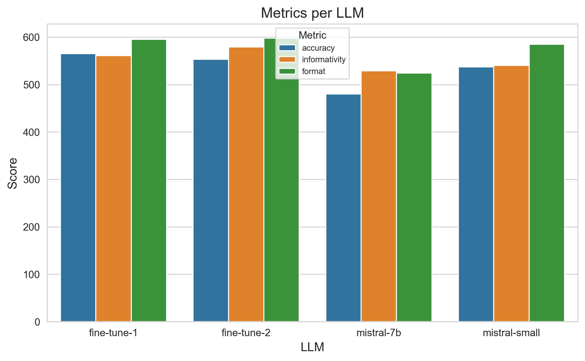
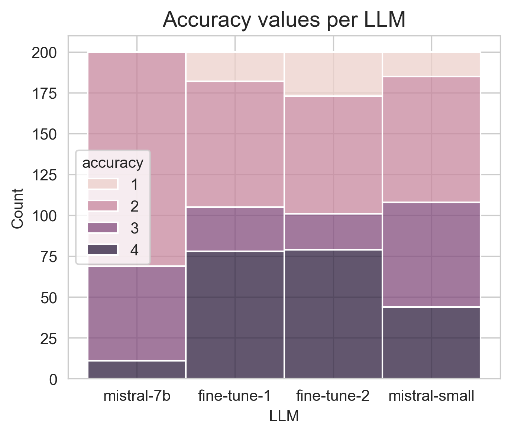

# metabo-assistant

This project was developed for the Mistral AI fine-tuning Hackathon, taking place in June 2024.

## Scientific background

Inside the cells, metabolic pathways are what determine is sugar is going to be converted to energy or fat for example.
They are composed of genes which can be more or less expressed (meaning there are more or less enzymes produced from
these genes). Gene-derived enzymes convert compounds (for example sugar) into another (for example fat).

Metabolic pathways are often altered in many diseases. To study these pathways in an exploratory way, researchers rely
on the measurements of gene expression and compound amounts. This will lead to having a list of genes, and a list of
compound, and wanting to deduce from these the metabolic pathway that is involved (called candidate pathway).

### Metabolic data collection

I extracted from scientific publications examples where researcher deduced a metabolic pathway from list of altered
genes and compounds (= **real examples**).
I also extracted from KEGG and NCBI database the list of all metabolic pathways, and for each the list of genes and
compounds involved (see [kegg-dataextract](https://github.com/csdevignes/kegg-dataextract) repository)
(= **database examples**).

While working with the database I realized that some pathways had zero compounds, only genes. Since I was interested
in crossing compounds and genes information, I excluded these pathways:
* Other glycan degradation
* Various types of N-glycan biosynthesis
* Other types of O-glycan biosynthesis
* Glycosaminoglycan biosynthesis - keratan sulfate

## LLM role - application behavior

The idea is to fine-tune a simple LLM model with data from cell metabolism, and assess if it can, based on a given list
of genes and compound, make interesting and relevant suggestions of altered metabolic pathways.

### Test using chat mistral

I first ran some test with mistral chat models to optimize the prompt and better define my case.
I used the [promptgenerator.py](promptgenerator.py) script to generate prompt from different real examples and then
tested it with the different mistral models. Test results are listed in [test-chat-results.md](prompts/test_chat_results.md)

Both Mistral Large and Small performed quite well, although they sometimes lacked precision and small model once did not
find the answer. Fine-tuning the small or 7B model with data from examples can maybe make it more precise
and accurate.

## Train dataset

Because of the lack of time, I could not mine the literature for sufficient real examples to have a train dataset.
I decided to generate examples from KEGG database data ([pathway_genes_compounds.json](prompts/pathway_genes_compounds.json)).
This was performed using [examplegeneration.py](examplegeneration.py)
Sets of (pathway, genes, compounds) were randomly drawn from KEGG database, and used to generate an explanation prompt
as for why this pathway is associated with these genes and compounds. I used mistral small since the chat test results
were OK. This explanation is then added to the dataset jsonl file, together with the userprompt containing genes
and compounds, without the pathway.

The dataset is labelled with the pathway used to generate the examples, for verification purpose.
The label is then deleted to form the final train dataset.

In order to have a balanced dataset, a method was implemented during example generation, in order to redraw until
all pathways have at least 11 examples. Once this is reached(968 examples), the remaining examples are drawn randomly.

### Train dataset verifications

Performed in Jupyter notebook [TrainDatasetVerif](TrainDatasetVerif.ipynb):
* pathway mentioned in assistant response is the right one (use of labelled dataset) : OK
* representation of each pathway : implemented a regulation during example generation (see above) : OK
* (future) vagueness of the answer / useless sentences : hypotheses to filter out
  * use another LLM to evaluate them
  * use embedding
  
## Fine-tuning

Using Mistral API in a Jupyter Notebook. First step is to remove the 'target' field from the data, and to split 
them in train (90%) and val (10%) jsonl datasets, which are stored in train folder.

* Iter1 : training was performed on a dataset of 500 messages, with 7B model (first test)
* Iter2 : training was performed on a dataset of 1000 messages, with 7B model. Metrics are recorded
in Weight and Biases.

### Improvements:

* Find a way to add more metrics to W&B : now only have train loss.
* See if possible to add text to the training dataset, to add also the raw kegg dataset
* (future) Work with embedding of the genes/compounds

## Evaluation of the models

Test dataset was created by drawing randomly from KEGG database. It was then presented to different models: mistral 7B,
mistral small, and 2 models fine-tuned from mistral 7B. First fine-tuned model was trained with 500 examples. 
Second was trained with 1000 examples and for 1 more step. To be fair to the different models, a short system prompt was
added to instruct them to find the altered pathway and return less than 200 words.

Responses of the models were then evaluated by mistral-Large (LLM as a judge method), with the following
criteria as instructions :
- metric: accuracy
    * Score 1: The pathway found in output is not even a metabolic pathway.
    * Score 2: The pathway found in output is a metabolic pathway.
    * Score 3: The pathway found in output is clearly stated and almost identical to the target pathway (ex: synthesis instead of degradation of the same compound).
    * Score 4: The pathway found in output is clearly stated and exactly the same as the target pathway (perfect match).

- metric: informativity
    * Score 1: No or incomplete citation of genes and compounds, or no justification
    * Score 2: Genes and compounds are cited but are not properly used to justify pathway choice, useless information
    * Score 3: Information about genes and compounds are exact and used properly to justify pathway choice in output.

- metric: format
    * Score 1: Output is longer than 200 words and does not include a metabolic pathway.
    * Score 2: Output is longer than 200 words or does not include a metabolic pathway.
    * Score 3: Output is shorter than 200 words and include one clearly named metabolic pathway.




The fine-tuning clearly improved the amount of perfect match regarding identified signaling pathway (accuracy score 4).
It also improves model informativity and answer formatting.

### Improvements

* Test dataset
  * with database examples : correct issue with random pick and redo
  * with real examples

## Interface to chat with the models

A streamlit app was generated to quickly interrogate the model. It is not available on the Cloud, but can be run in 
local, by downloading [metabo_assistant.py](metabo_assistant.py) and running :
```
streamlit run metabo_assistant.py
```
Installation of packages from [requirements.txt](requirements.txt) might be needed.

## Improvements (general)

* freeze requirements
* organize for rerun